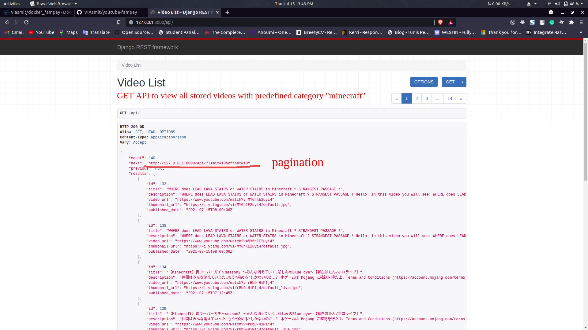
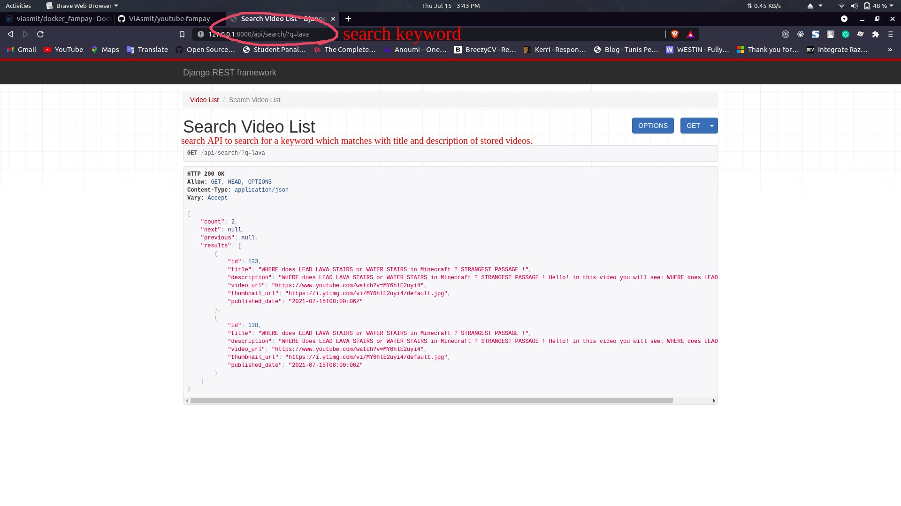

# Fampay Task - Youtube Search Backend

To make an API to fetch latest videos sorted in reverse chronological order of their publishing date-time from YouTube for a given tag/search query in a paginated response.

## Installation

Use the package manager [pip](https://pip.pypa.io/en/stable/) to install.

```bash
pip install -r requirement.txt
```

## Usage

### Normal Installation

```python
git clone https://github.com/ViAsmit/youtube-fampay

# make migrations
python3 manage.py makemigrations

# migrate the changes
python3 manage.py migrate

# run the server
python3 manage.py runserver

```

### Docker way

```bash
# pull image from dockerhub
docker pull docker pull viasmit/docker_fampay

# run container and listen to port 8000 in detached mode
docker run -dp 8000:8000 viasmit/docker_fampay


```

## Screenshots





### All API ENDPINTS automatically refreshed in 30 seconds

### To view all the saved video in paginated response

[http://0.0.0.0:8000/api](http://0.0.0.0:8000/api)

### To search for the saved video in paginated response

[http://0.0.0.0:8000/api/search/?q=minecraft](http://0.0.0.0:8000/api/search/?q=minecraft)

## Contributing

Pull requests are welcome. For major changes, please open an issue first to discuss what you would like to change.

Please make sure to update tests as appropriate.

## License

[MIT](https://choosealicense.com/licenses/mit/)
